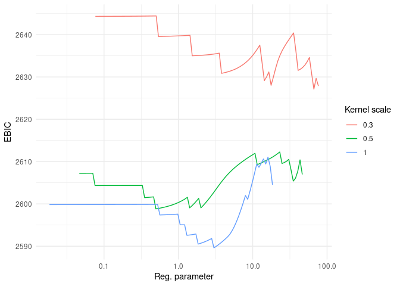

<!-- README.md is generated from README.Rmd. Please edit that file -->

Last updated: *Aug-25-2024*

# LSVCMM

<!-- badges: start -->
[](https://github.com/fontaine618/LSVCMM/actions/workflows/R-CMD-check.yaml)
[](https://cran.r-project.org/package=LSVCMM)
<!-- badges: end -->

## Installation

You can install the development version of LSVCMM from
[GitHub](https://github.com/) with:

``` r
# install.packages("devtools")
devtools::install_github("fontaine618/LSVCMM")
```

## Example

This is a basic example which shows you how to solve a common problem:

``` r
library(LSVCMM)
instance = generate_synthetic_data()
#> New names:
#> • `` -> `...1`
#> • `` -> `...2`
fit = lsvcmm(
  data=instance$data, 
  response="response",
  subject="subject_id",
  time="time",
  vc_covariates="group",
  kernel=list(scale=c(0.1, 0.2, 0.3)),
  penalty=list(adaptive=0.5, penalize_intercept=T)
)
```

``` r
library(ggplot2)
ggplot() + 
  geom_line(
    data=fit$results,
    mapping=aes(x=penalty.lambda, y=ebich, color=as.factor(kernel.scale), group=kernel.scale)
  ) + scale_x_log10() + 
  theme_minimal() + labs(color="Kernel scale", x="Reg. parameter", y="EBIC")
```



``` r

i = which.min(fit$results$ebich)
t(fit$vc_path[,,i])
#>             [,1]       [,2]
#>  [1,]  0.0000000 -0.1212567
#>  [2,]  0.0000000  0.0000000
#>  [3,]  0.0000000  0.0000000
#>  [4,]  0.0000000  0.0000000
#>  [5,]  0.0000000  0.0000000
#>  [6,]  0.0000000  0.0000000
#>  [7,] -0.1706565  0.9256777
#>  [8,] -0.4979099  1.5050463
#>  [9,]  0.0000000  0.8563264
#> [10,]  0.0000000  0.6370261
#> [11,]  0.0000000  1.0393079
instance$true_values
#>    time b0        b1
#> 1   0.0  0 0.0000000
#> 2   0.1  0 0.0000000
#> 3   0.2  0 0.0000000
#> 4   0.3  0 0.0000000
#> 5   0.4  0 0.0000000
#> 6   0.5  0 0.1192029
#> 7   0.6  0 0.5000000
#> 8   0.7  0 0.8807971
#> 9   0.8  0 0.9820138
#> 10  0.9  0 0.9975274
#> 11  1.0  0 0.9996646
fit$results[i, ]
#>           llk      rss family.dispersion family.name
#> 295 -1223.691 965.8111          1.289467    gaussian
#>                    penalty.name penalty.alpha penalty.lambda penalty.adaptive
#> 295 adaptive_sparse_group_lasso             1    0.004019454              0.5
#>     penalty.penalize_intercept link_function.name working_covariance.estimate
#> 295                       TRUE           identity                       FALSE
#>     working_covariance.ratio working_covariance.name kernel.name kernel.scale
#> 295                 0.370352       compound_symmetry    gaussian          0.3
#>     control.max_iter control.max_rounds control.rel_tol control.verbose
#> 295             1000                 50           1e-06               1
#>     control.update_method control.backtracking_fraction
#> 295                   PGD                           0.9
#>     control.two_step_estimation control.stepsize_factor      penalty df
#> 295                        TRUE                       1 0.0001054492  8
#>     df_kernel df_logn df_logn_kernel df_max      aic     aich      bic     bich
#> 295  1.367732 52.5942       8.991848     22 2463.382 2450.117 2499.976 2456.374
#>         ebic    ebich
#> 295 2524.704 2460.601
```
